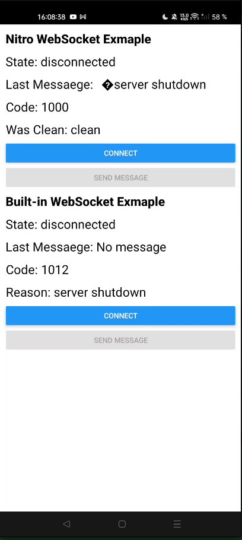

# Example of Reproducing an Error in react-native-nitro-websockets
Steps to reproduce:
  1. Go to the server directory and run the command `node index.js`
  2. Go to the example directory and run the command `node run start`
  3. Open the app in the Android emulator or on a device
  4. Tap the “Connect” button in the “Nitro WebSocket Example” block
  5. Wait 2 seconds
  6. View the information on the screen
  7. You can also click the “Send message” button to test the connection

You can also check out the example of using the built-in WebSocket in the “Built-in WebSocket Example” section. Follow steps 4–7.

# Example Screenshot:

